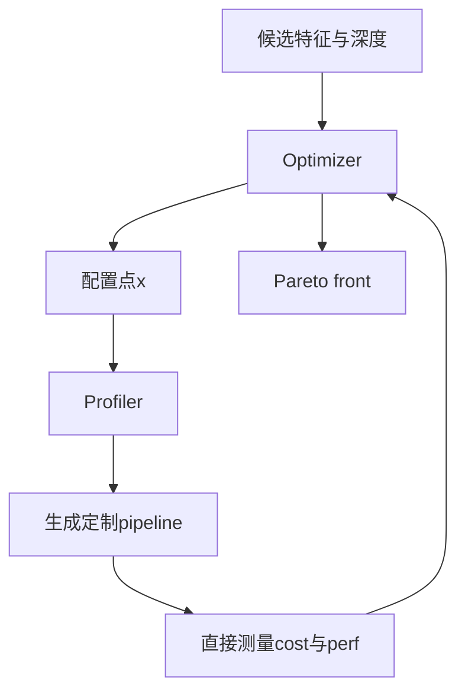

# 论文精读：CATO: End-to-End Optimization of ML-Based Traffic Analysis Pipelines

- **论文**：*CATO: End-to-End Optimization of ML-Based Traffic Analysis Pipelines*
- **会议**：USENIX NSDI 2025
- **年份**：2025
- **来源**：/Users/dusker/Zotero/storage/3D4CE8TR/.zotero-ft-cache
- **代码**：文中给出 GitHub 仓库 `https://github.com/stanford-esrg/cato`（该信息来自论文正文）
- **用途**：组会精读 / 讨论版
- **说明**：以下内容仅基于已提供的论文缓存文本整理。结论尽量附证据位置。对尚未在已读材料中直接确认的内容，统一标注 `[需核对]` 或 `[文中未明确说明]`。

---

## 0. 一句话先讲清楚

这篇论文解决的不是“怎样让流量分析模型更准”这么简单，而是：**怎样让一个基于机器学习的流量分析系统在真实网络里既准又能跑得动。**

CATO 的核心观点是：在 traffic analysis 里，真正上线时消耗资源的不只是模型推理，还包括 **packet capture、feature extraction、inference** 的整条 serving pipeline。因此，优化目标必须从“模型指标”扩展到“端到端系统成本 + 预测性能”的联合优化。

**证据来源**：Abstract；Section 1；Section 2。

---

## 1. 摘要原文的中文化理解

机器学习已经广泛用于流量分类、入侵检测、QoE 推断等任务，但这些方法在真实网络环境中往往面临部署困难。原因在于，很多工作只关注离线预测性能，比如 accuracy、F1、RMSE，却忽略了模型在实际在线流量处理中所需要的完整系统开销。对于真实流量分析任务来说，用户真正部署的是一个 pipeline，而不是一个孤立模型。

CATO 提出一个框架，用于**同时优化预测性能与系统成本**。它将问题形式化为一个**多目标优化问题**，利用 **multi-objective Bayesian optimization** 搜索 Pareto-optimal 配置，并自动编译出针对该配置优化过的端到端 serving pipeline。评估结果显示：相较于常见的特征优化技术，CATO 可以实现最高 **3600× 更低 latency**、**3.7× 更高 zero-loss throughput**，同时预测性能也更好。

**证据来源**：Abstract。

---

## 2. 论文到底在反对什么

### 2.1 它反对“只看模型分数”的研究习惯

很多 traffic analysis 工作默认这样一条流程：

1. 从 trace 中抽取特征；
2. 用这些特征训练一个模型；
3. 报告 accuracy、F1、RMSE 等结果；
4. 认为方法已经足够好。

CATO 认为这样不够，因为在真实部署中，系统真正面对的是：

- 数据包必须实时捕获；
- 特征必须在线提取；
- 推理必须在有限资源与延迟约束下完成；
- 如果处理不及时，就会出现丢包，进而使得模型输入失真。

所以，论文强调：

> **高预测性能不等于可部署。**

**证据来源**：Section 1；Section 2。

### 2.2 为什么 traffic analysis 尤其需要端到端优化

论文指出，很多流量分析场景对实时性要求很强，例如：

- 需要亚秒级反应；
- 需要在线处理高速链路；
- 需要在高吞吐环境下维持 zero-loss。

在这种系统里，哪怕 feature extraction 或 inference 只多出一点额外延迟，也可能导致后续 packet 丢失，最终让整个 ML pipeline 失效。

因此，traffic analysis 不是简单的“模型效果越高越好”，而是一个典型的 **ML systems** 问题。

**证据来源**：Section 1；Section 2。

---

## 3. 为什么这个优化问题很难

### 3.1 搜索空间本身就爆炸

CATO 要优化的不是一个单一模型超参数，而是一个配置点 `x = (F, n)`：

- `F`：选择哪些特征；
- `n`：等待连接到多深再提取特征，也就是 connection depth。

如果候选特征集合大小为 `|F|`，那么特征子集的数量就是 `2^|F|`。再叠加不同 depth 的选择，搜索空间会进一步扩大。

**证据来源**：Section 1；Section 2.2；Figure 2；Section 3.1。

### 3.2 更难的是“成本不是独立可加的”

直觉上你可能会想：

- 每个特征算一次成本；
- 然后把选中的特征成本加起来；
- 再加一个模型推理时间；
- 不就能估计整条 pipeline 成本了吗？

论文指出这不可靠，因为：

- 特征之间共享 packet parsing；
- 某些中间结果可以复用；
- 不同流量模式下成本表现不同；
- 资源竞争和系统调度也会影响测量结果。

换句话说，端到端成本不是“模块成本简单相加”就能得到的。

因此作者明确提出：

> **不要猜成本，要直接测量成本。**

**证据来源**：Section 3.4 Why Measure?。

---

## 4. CATO 的核心思想

### 4.1 一句话版

**CATO = 用多目标 BO 搜索 `(feature subset, depth)` 的 Pareto front，再用 Profiler 为每个候选点编译一个真正可运行、且没有 runtime branching 开销的定制 pipeline，并直接测量它的真实 cost 和 perf。**

**证据来源**：Abstract；Section 3；Figure 3；Section 3.4；Figure 4。

### 4.2 为什么它是“系统 + 优化”而不是单纯 AutoML

如果只看名字，你可能会以为 CATO 只是把 BO 用在特征选择上。但真正特别的地方是：

- 它优化的是**端到端系统**，不是单独模型；
- 它的 feedback 来自**真实 pipeline 的直接测量**，不是离线估计；
- 它最后产出的是一条**可以部署的 pipeline**，不是一组抽象超参数。

这就是论文最核心的 systems 贡献。

**证据来源**：Section 3.2；Section 3.4；Figure 3。

---

## 5. 问题形式化

### 5.1 优化变量是什么

论文把搜索空间定义为：

- 候选特征集合 `F`；
- 最大连接深度 `N`；
- 搜索空间 `X = P(F) × N`。

也就是说，每一个配置点 `x` 都由两部分组成：

- 选哪些特征；
- 流量看到多深就做判断。

**证据来源**：Section 3.1。

### 5.2 两个目标函数是什么

CATO 同时优化两个目标：

- `cost(x)`：系统成本；
- `perf(x)`：预测性能。

文中举的 cost 指标包括：

- 端到端 latency；
- zero-loss throughput 的相反数；
- execution time。

文中举的 perf 指标包括：

- F1；
- RMSE。

最终目标不是找一个单点最优，而是找出**Pareto front**，也就是一组互不支配的解。

**证据来源**：Section 3.1；Table 1；Section 4 Objective Functions。

### 5.3 为什么要输出 Pareto front

因为不同部署者的需求不同：

- 有的人更重视吞吐；
- 有的人更重视 latency；
- 有的人可以接受一点点性能下降，换取巨大系统收益；
- 有的人则相反。

如果只输出一个固定最优点，用户还得重新优化才能适配新约束。输出 Pareto front 的好处是：

> **一次搜索，保留整条性能-成本折中曲线。**

**证据来源**：Section 3.1。

---

## 6. 系统结构：Optimizer + Profiler

### 6.1 总体架构图



**证据来源**：Figure 3；Section 3.2。

### 6.2 两个模块各自做什么

#### Optimizer

负责在巨大的搜索空间里选择下一个值得测量的配置点。它不可能穷举所有点，因此要用 sample-efficient 的优化方法。

#### Profiler

负责把一个抽象配置点真正变成一条可运行的 serving pipeline，然后测量这个点的真实代价与效果，并把结果反馈给 Optimizer。

这两个模块形成一个闭环：

- Optimizer 负责“猜下一个值得试谁”；
- Profiler 负责“把它真跑起来并告诉你结果”。

**证据来源**：Section 3.2；Figure 3。

---

## 7. Optimizer：为什么是 Bayesian Optimization

### 7.1 为什么不用穷举或简单启发式

因为每评估一个配置点都很贵：

- 要生成 pipeline；
- 要实际运行测量；
- 还要计算性能与系统指标。

因此这个问题非常符合 BO 的典型适用条件：

- black-box；
- expensive evaluation；
- 非线性；
- 不可导。

**证据来源**：Section 3.3。

### 7.2 论文如何把 BO 适配到 traffic analysis 场景

论文没有直接照搬通用 BO，而是做了针对性改造。

#### 第一，降维

默认去掉 mutual information 为 0 的特征，以减小搜索空间。

#### 第二，注入 feature prior

作者用 mutual information 给特征一个先验偏好：信息量更高的特征，更可能出现在 Pareto-optimal 配置中。但为了避免优化器总是被最高 MI 的特征“绑死”，论文加入一个 damping coefficient `δ`。

#### 第三，注入 depth prior

作者认为更深的连接深度一般成本更高，因此给更浅 depth 更高 prior probability。

这些设计的本质是：

> **把领域知识作为先验，减少无效搜索。**

**证据来源**：Section 3.3 Tailoring BO。

### 7.3 已明确的实现细节

论文在实现部分明确提到：

- 基于 **HyperMapper**；
- prior injection 使用 **πBO**；
- surrogate model 使用 **Random Forest**；
- depth prior 使用 `Beta(α=1, β=2)`；
- 初始化时先做 3 轮 random search；
- `δ = 0.4`。

这些细节在组会上是很好的“落地感”信息。

**证据来源**：Section 4 Implementation。

---

## 8. Profiler：这篇论文最系统味的地方

### 8.1 为什么一定要直接测量

作者专门用一节解释 “Why Measure?”，核心论点是：

- feature extraction 存在共享解析；
- 某些特征组合起来比单独相加更便宜；
- 某些 pipeline bottleneck 只有真正在线跑起来才会暴露；
- 资源争用、输入流量模式都会改变实际表现。

所以如果只靠离线估计，会误导优化器，最终选出“看起来便宜、实际不便宜”的点。

**证据来源**：Section 3.4 Why Measure?。

### 8.2 为什么不能用 runtime branching

如果 Profiler 用一个大而全的程序，在运行时根据配置判断“哪些特征该算、哪些不该算”，那么每个配置都会额外承担判断开销。这会让 cost 测量被 runtime branching 的 overhead 污染。

因此论文采用 **conditional compilation**：

- 每个配置点都单独编译；
- 只把需要的特征逻辑编进 binary；
- 不需要的分支根本不会进入最终程序。

这样得到的 pipeline 更接近“人工为该配置手写的一条高效 pipeline”。

**证据来源**：Section 3.4 Pipeline Generation；Figure 4。

### 8.3 这件事为什么重要

这不仅提升运行效率，更关键的是：

> **它保证优化器看到的 cost，是该配置真实的系统成本，而不是测量工具本身带来的伪开销。**

这点非常关键，因为如果 feedback 本身不准，那么 BO 搜索出来的 Pareto front 也会偏掉。

该解释基于 Section 3.4 的设计逻辑。

---

## 9. Figure 4 代码片段到底在干什么

这一段如果你没有 Rust 基础，很容易被语法表面吓到。但从论文角度看，它真正想证明的不是“Rust 很高级”，而是：

> **CATO 能把“选中了哪些特征”直接编译进 serving pipeline，所以最终 binary 只保留真正需要的解析和计算步骤。**

换句话说，Figure 4 的重点不是语言，而是**编译策略**。

**证据来源**：Figure 4；Section 3.4 Pipeline Generation。

### 9.1 先把论文里的代码片段贴出来

下面这段就是论文 Figure 4 给出的示例性 Rust 伪代码片段。我保留了它的核心结构，方便你后面对照阅读。

```rust
fn on_packet(&mut self, packet: Packet) {
    #[cfg(any(feature = "iat_sum"))]
    {
        let pkt_timestamp = packet.timestamp();
        self.iat_sum += pkt_timestamp - last_timestamp;
        let last_timestamp = pkt_timestamp;
    }

    #[cfg(any(feature = "ttl_min", feature = "winsize_max"))]
    let eth = packet.parse_eth();

    #[cfg(any(feature = "ttl_min", feature = "winsize_max"))]
    let ipv4 = eth.parse_ipv4();

    #[cfg(any(feature = "ttl_min"))]
    self.ttl_min = self.ttl_min.min(ipv4.ttl());

    #[cfg(any(feature = "winsize_max"))]
    {
        let tcp = ipv4.parse_tcp();
        self.winsize_max = self.winsize_max.max(tcp.winsize());
    }
}

fn extract(&mut self) -> Vec<f64> {
    vec![
        #[cfg(feature = "iat_sum")]
        self.iat_sum,
        #[cfg(feature = "ttl_min")]
        self.ttl_min,
        #[cfg(feature = "winsize_max")]
        self.winsize_max,
    ]
}
```

**说明**：这段代码是基于论文 Figure 4 的展示性片段整理，用于讲解 CATO 的 pipeline generation 思想；它在论文里本身也是示例代码，而不是完整项目源码。（证据：Figure 4 caption；Section 4 Pipeline Generation）

### 9.2 再把这几种 Rust 写法翻译成人话

| Rust 写法 | 你可以怎么理解 | 在 Figure 4 里扮演什么角色 |
|---|---|---|
| `fn on_packet(...)` | “每来一个包，就执行一次这个函数” | 在线更新特征统计量 |
| `&mut self` | “我会修改当前对象里的内部状态” | 例如更新 `iat_sum`、`ttl_min` |
| `let x = ...` | “定义一个临时变量” | 保存解析出来的 header |
| `self.xxx += ...` / `self.xxx = ...` | “把统计量写回对象状态” | 累加、取最小值、取最大值 |
| `parse_eth()` / `parse_ipv4()` / `parse_tcp()` | “把包往下一层协议继续解析” | 只在某些特征需要时才解析 |
| `Vec<f64>` | “最终输出给模型的一串数值特征” | 形成 feature vector |
| `#[cfg(feature="...")]` | **“编译期开关”**：如果没选这个 feature，这段代码根本不会出现在最终程序里 | CATO 降低运行时开销的关键抓手 |

如果你只记一个点，就记这个：

> `#[cfg(...)]` 不是运行时 `if`，而是**编译时删代码**。

这就是 CATO 和普通“运行时判断要不要算某个特征”的做法最本质的差别。

**证据来源**：Figure 4；Section 3.4 Pipeline Generation。

### 9.3 按 Figure 4 的逻辑逐段看

论文 Figure 4 给的是一个“模板 subscription 模块”的片段。你可以把它理解成：

- `on_packet()`：每收到一个包，就更新一次当前连接的统计量；
- `extract()`：连接到达指定 depth 后，把已经累计好的统计量吐出来，组成最终特征向量。

下面按代码块拆开看。

#### 第一段：按需计算包到达间隔特征

Figure 4 开头的这段逻辑大意是：

- 如果当前选择了 `iat_sum` 这个特征；
- 那么每来一个包，就取当前时间戳；
- 与上一个包的时间戳做差；
- 再把这个差值累加到 `self.iat_sum`。

你可以把它理解成：**在线维护“包间隔总和”这个统计量。**

这里最重要的不是 `+=` 语法，而是：

- **没选 `iat_sum` 时，这整个代码块不会被编译进去；**
- 所以系统不会为了一个没用到的特征白白读取时间戳、做减法、做累加。

#### 第二段：共享解析 Ethernet / IPv4

Figure 4 中间有两行：

- `let eth = packet.parse_eth();`
- `let ipv4 = eth.parse_ipv4();`

但它们前面都挂着：

- `#[cfg(any(feature="ttl_min", feature="winsize_max"))]`

意思是：**只有当 `ttl_min` 或 `winsize_max` 至少有一个被选中时，才需要把包解析到 IPv4 层。**

这正是论文强调的“共享解析复用”：

- `ttl_min` 需要 IPv4 header；
- `winsize_max` 也需要先走到 IPv4，再进 TCP；
- 那么 IPv4 解析这一步只做一次，不重复做两遍。

你可以把它想成厨房里的“备菜”动作：

- 两道菜都要先切葱；
- 那就切一次葱，别每道菜重新切。

**证据来源**：Figure 4 代码说明文字；Section 3.4 Why Measure?。

#### 第三段：更新 `ttl_min`

Figure 4 接着写：

- 如果选了 `ttl_min`；
- 就执行 `self.ttl_min = self.ttl_min.min(ipv4.ttl())`。

这句的意思很简单：

> “把当前看到的 TTL 和历史最小 TTL 比一下，留下更小的那个。”

所以 `ttl_min` 本质上就是一个**在线最小值统计器**。

这类写法很典型：

- 不需要把所有包都存下来；
- 只需要维护一个滚动统计量；
- 每来一个包更新一次状态即可。

#### 第四段：更新 `winsize_max`

如果选了 `winsize_max`，代码会继续：

- 从 IPv4 再解析到 TCP；
- 读取 TCP window size；
- 用 `max(...)` 更新当前最大值。

这说明：

- `winsize_max` 的计算比 `ttl_min` 多一步 TCP 解析；
- 所以它的系统成本通常更高；
- 但如果当前 representation 根本不需要它，这一步连进入 binary 的机会都没有。

这正是 CATO 要精细优化的地方：**不同特征不只“信息量”不同，系统代价也不同。**

#### 第五段：把状态导出成模型输入

最后的 `extract() -> Vec<f64>` 可以直接理解成：

- “连接观察到指定深度后，把所有已经算好的统计量按顺序打包成一个数值向量，喂给模型。”

其中 `vec![ ... ]` 就是在构造 feature vector。更关键的是，里面每一项前面也带着 `#[cfg(feature="...")]`：

- 选了 `iat_sum`，输出里才有 `self.iat_sum`；
- 选了 `ttl_min`，输出里才有 `self.ttl_min`；
- 选了 `winsize_max`，输出里才有 `self.winsize_max`。

所以这里的底层逻辑非常清楚：

> **前面计算什么，后面就只输出什么；没有被选中的特征，既不计算，也不输出。**

### 9.4 如果你完全不懂 Rust，可以把 Figure 4 翻译成下面这段伪代码

```text
每来一个包：
    如果需要 iat_sum：更新包间隔总和
    如果需要 ttl_min 或 winsize_max：先解析 Ethernet 和 IPv4
    如果需要 ttl_min：更新最小 TTL
    如果需要 winsize_max：继续解析 TCP，更新最大窗口大小

连接到达指定 depth 后：
    输出所有被选中特征组成的向量
    把这个向量交给模型推理
```

如果你在组会上解释这段代码，直接这样说就够了：

> **这段 Rust 代码本质上是一个“按需启用的在线特征提取器”。每个包进来时，它只做当前 representation 真正需要的解析和统计；到达指定深度后，再把这些统计量拼成特征向量送给模型。**

### 9.5 它为什么比 runtime branching 更重要

论文专门比较了两种思路：

| 做法 | 运行时会发生什么 | 问题是什么 |
|---|---|---|
| runtime branching | 每个包都要先判断“这个特征要不要算” | 判断逻辑本身会引入额外开销，污染 cost 测量 |
| conditional compilation | 只把当前 representation 需要的逻辑编进 binary | 更接近人工手写的最优 pipeline，测到的 cost 更真实 |

所以 Figure 4 的真正价值，不是“给你展示一段 Rust”，而是证明：

1. CATO 确实能为**每个候选配置点**生成专属 pipeline；
2. 这个 pipeline 的性能接近“人工为该点单独手写”的版本；
3. 因而 Optimizer 收到的 cost feedback 更可信。

这就是整篇论文的系统抓手。

**证据来源**：Section 3.4 Pipeline Generation；Figure 4 说明文字。

### 9.6 为什么这段代码和整篇论文的主张强相关

这段代码其实把论文的三层主张拉通了：

| 论文主张 | Figure 4 对应体现 |
|---|---|
| 特征组合不同，系统成本不同 | 不同 feature 会触发不同解析与统计路径 |
| 成本不能靠拍脑袋估计 | 每个 representation 都真的编译并运行 |
| 最优解是 feature subset 和 depth 的联合结果 | pipeline 同时编码“算哪些特征”和“观察到多深就停” |

所以你可以把 Figure 4 看成整篇论文最“落地”的一个证据：

> **CATO 不是停留在优化器层面喊口号，而是真的把“representation → executable pipeline”这件事做出来了。**

### 9.7 已明确的工程实现规模

- 候选特征数：**67**；
- Rust 实现规模：约 **1600 行**；
- pipeline 生成基于一个修改版 **Retina**，它本身是一个把 traffic subscription 编译成高效 packet processing pipeline 的 **Rust framework**；
- 连接深度定义：文中实现里使用 **packet count**。

这几个数字说明：CATO 的 Profiler 不是一段 toy code，而是一个有明确工程体量的系统组件。

**证据来源**：Section 4 Pipeline Generation；Table 4 候选特征集说明。

### 9.8 Rust 小白专属附录：如果你完全不懂 Rust，就记这几件事

**说明**：这一小节主要是为了帮助没有 Rust 基础的读者读懂 Figure 4，属于基于论文代码片段的讲解性解释，不是作者原文逐句翻译。

#### 9.8.1 先别把它当 Rust，把它当“连接状态更新流程”

你可以把 `self` 理解成“这个连接当前的小账本”。

这个小账本里记录着一些到目前为止已经统计出来的量，例如：

- `iat_sum`：到目前为止的包间隔总和；
- `ttl_min`：到目前为止观察到的最小 TTL；
- `winsize_max`：到目前为止观察到的最大 TCP window size。

于是整个流程就很好懂了：

- 每来一个包，`on_packet()` 就更新一次这个“小账本”；
- 到达指定 depth 后，`extract()` 就把账本里的值取出来，拼成一个数值向量，交给模型。

#### 9.8.2 `&mut self` 你可以粗暴理解成“这个函数会改内部状态”

如果不从语言细节抠，`&mut self` 对初学者来说可以直接理解成：

> 这个函数不是只读一眼数据，而是会修改当前连接对象里已经存着的统计量。

所以你看到：

- `self.iat_sum += ...`
- `self.ttl_min = ...`
- `self.winsize_max = ...`

本质上都只是“更新小账本”。

#### 9.8.3 `let` 不难，它更像“先把这个结果起个名字”

例如：

- `let eth = packet.parse_eth();`
- `let ipv4 = eth.parse_ipv4();`
- `let tcp = ipv4.parse_tcp();`

你可以把它理解成：

- 先把包解析成以太网头；
- 再往下解析成 IPv4；
- 如果还需要 TCP 相关特征，就继续解析到 TCP。

这里的 `let` 更接近数学里的“记这个量为 x”，不是需要专门害怕的 Rust 黑魔法。

#### 9.8.4 这段代码最重要的不是语法，而是“按需解析、按需计算”

Figure 4 真正想表达的其实只有三件事：

1. **只有需要某个特征时，才执行相应的计算；**
2. **多个特征共用同一层解析结果时，只解析一次；**
3. **最后只导出真正被选中的那些特征。**

所以它的重点不是“如何写 Rust”，而是“如何把 feature representation 直接变成高效 pipeline”。

#### 9.8.5 为什么 `#[cfg(...)]` 比普通 `if` 更关键

如果把逻辑写成运行时分支，例如：

```rust
if need_ttl_min {
    // 运行时再判断要不要算
}
```

那么每个包进来时，程序都要先判断一次。

但 Figure 4 用的是：

```rust
#[cfg(feature = "ttl_min")]
```

它的含义是：

> **如果这个 feature 没被选中，这段代码在编译时就直接被删掉了。**

这正是论文在系统层面最强调的地方：它要避免 runtime branching 的额外开销，让测到的 cost 更接近“人工手写最优 pipeline”的真实表现。（证据：Section 3.4 Pipeline Generation；Figure 4）

#### 9.8.6 如果你觉得代码不像“完整可运行程序”，这是正常的

Figure 4 的角色本来就是**展示 pipeline generation 思想的示例性片段**，不是论文附的完整工程源码。

所以阅读时最重要的是抓住：

- 哪些操作在特征被选中时才出现；
- 哪些解析步骤被多个特征共享；
- 最终如何把统计量导出成模型输入。

不要把注意力过多放在“这是不是一份完整 Rust 项目代码”。

#### 9.8.7 你在组会上可以直接这样解释 Figure 4

> **对没有 Rust 基础的人来说，Figure 4 可以直接理解成一个“按需裁剪的在线特征提取器模板”。CATO 先决定要哪些特征，再把不需要的解析和统计逻辑在编译期删掉，所以最终得到的是一条只保留必要步骤的高效 serving pipeline。**

#### 9.8.8 如果你只想记住一句话

> **这段代码不是在炫 Rust 语法，而是在证明：CATO 能把 feature selection 的结果真正落到可执行、可测量、可部署的 pipeline 上。**

---

## 10. 模型训练部分在整篇文章里的位置

### 10.1 为什么模型不是主角

论文支持多种模型：

- DT；
- RF；
- DNN。

但模型在这里更多是 pipeline 的一部分，而不是创新核心。作者的重点是：

- 任何模型都不该脱离 feature cost 和 serving cost 单独优化；
- 同样的模型，在不同 feature subset 和 depth 下，端到端表现可能截然不同。

**证据来源**：Section 4 Model Training。

### 10.2 已明确的训练实现

#### DT / RF

- 使用 scikit-learn；
- 采用 5-fold nested CV + grid search；
- RF 使用 100 个 estimators；
- 最终再用 Rust SmartCore 重训最优 DT/RF，以匹配 Rust feature extraction 的运行环境。

#### DNN

- 使用 TensorFlow 三层 MLP；
- 包含 ReLU、L2、dropout、Adam；
- 因 Rust 侧 DNN 库还不成熟，DNN 评估在 Python/TensorFlow 侧完成。

**证据来源**：Section 4 Model Training。

---

## 11. 论文最想让你记住的两个结论

### 11.1 结论一：feature subset 和 depth 必须联合优化

论文在 Figure 2 中强调两点：

- **最佳特征集合会随着 depth 改变**；
- **更浅不一定更便宜**。

第二点非常反直觉。因为你可能会以为：越早决策，肯定越快。但论文指出，如果为了更早决策而不得不提取一组很昂贵的特征，那么整体成本反而可能更高。相反，多等几个包，可能就能用一组更简单、共享更多解析步骤的特征，最终更省。

这正是它反对“只做 early inference”或“只做 feature selection”的原因。

**证据来源**：Section 2.2；Figure 2。

### 11.2 结论二：真实系统测量不可替代

如果不直接测量 end-to-end cost，那么很多优化决策会建立在错误的成本模型上。CATO 认为，对 traffic analysis 这种系统来说，**测量本身是优化的一部分**。

**证据来源**：Section 3.4 Why Measure?。

---

## 12. 结果应该怎么解读

### 12.1 摘要里最值得记的数字

与常见特征优化技术相比，CATO 可以实现：

- **最高 3600× 更低 latency**；
- **最高 3.7× 更高 zero-loss throughput**；
- 同时还具有更好的预测性能。

**证据来源**：Abstract。

### 12.2 为什么这些数字有说服力

因为这些提升不是只来自“模型换强一点”，而是来自：

- feature subset 更合理；
- depth 更合理；
- pipeline 实现更接近手写高效版本；
- 优化器拿到的是端到端真实反馈。

所以它体现的是**系统级 redesign** 的收益，而不是单点 trick。

这是一种归纳性解释，具体场景下的明细表格仍需继续核对 Section 5 `[需核对]`。

### 12.3 和 Traffic Refinery 等工作的关系

论文在评估部分提到会与 Traffic Refinery 之类 cost-aware 系统比较，并强调自身 BO + Profiler + direct measurement 的能力；但当前已读片段还没有完整展开对应实验表格和数值，因此这部分结论应保守表达为 `[需核对]`。

**证据来源**：Section 5 引言提及。

---

## 13. 这篇论文的优势与局限

## 13.1 优势

### 优势 1：问题定义很到位

它把“能不能部署”正式纳入优化目标，而不是默认系统成本可以后处理解决。

**证据来源**：Section 1；Section 2。

### 优势 2：方法链条完整

从问题形式化、优化算法到系统实现与直接测量，整篇论文逻辑是闭环的。

**证据来源**：Section 3；Section 4。

### 优势 3：conditional compilation 很有工程价值

它不是简单写一个 profiler，而是确保每个候选点都以接近最佳实现的方式运行，从而让成本测量更可信。

**证据来源**：Section 3.4；Figure 4。

### 优势 4：Pareto front 输出形式实用

它允许不同部署目标的用户从同一次搜索结果中挑选适合自己的 operating point。

**证据来源**：Section 3.1。

## 13.2 局限

### 局限 1：真实测量本身仍然昂贵

虽然 BO 比穷举高效得多，但每个配置点都需要生成并测量 pipeline，因此整体 wall-clock cost 仍可能较高。论文提到附录报告了相关时间，但当前片段未读到具体数字。

**证据来源**：Section 3.4；Appendix E 提及。

### 局限 2：结果受候选特征集合限制

如果输入给 CATO 的候选特征本身不够强，那么它再怎么优化，也只能在这个受限空间里找最优折中。

**证据来源**：Section 3.1。

### 局限 3：当前实现中的 depth 定义较特定

论文当前实现里把 connection depth 定义为 packet count。对于其他任务，depth 也可能定义为 bytes 或 time，但在已读实现部分中主要采用了 packet count；不同定义的泛化效果和工程差异还需进一步核对。

**证据来源**：Section 3.1；Section 4 Pipeline Generation。

---

## 14. 组会上怎么讲最顺

建议按下面这条主线讲：

```text
很多流量分析论文只优化 accuracy/F1，但真实部署还要算 capture、feature、inference 的整条 pipeline 成本
        ↓
因此最优 feature set 和最优决策深度不能分开看，必须联合优化
        ↓
而且系统成本不能靠估计，要让每个候选配置真正运行起来并直接测量
        ↓
CATO 用多目标 BO 搜 Pareto front，用 Profiler 条件编译出定制 pipeline 做真实测量
        ↓
最终得到又准又快、且可部署的 traffic analysis pipeline
```

---

## 15. 3 分钟版本

### 第一分钟：讲问题

这篇论文批评现有 traffic analysis 研究过于关注离线预测指标，却忽略端到端 serving 成本。现实中系统要实时抓包、提特征、做推理，任何一环慢了都可能导致丢包和失效。

**证据来源**：Section 1；Section 2。

### 第二分钟：讲方法

CATO 把配置定义为“选哪些特征 + 在多深的时候做判断”，然后用多目标 BO 搜索性能与成本的 Pareto front。每评估一个候选点时，它不会做粗略估计，而是通过 Profiler 用 conditional compilation 生成一条定制 pipeline，真实运行并测量 latency、throughput、execution time 和模型性能，再把结果反馈给 BO。

**证据来源**：Section 3.1；Section 3.3；Section 3.4；Figure 3；Figure 4。

### 第三分钟：讲结果

论文摘要给出的核心结果是：相对常见特征优化技术，CATO 可实现最高 **3600× 更低 latency**、**3.7× 更高 zero-loss throughput**，而且预测性能更好。它真正的贡献是把“可部署性”提升为和“预测性能”同等级的优化目标。

**证据来源**：Abstract。

---

## 16. 组会常见 Q&A

### Q1. CATO 优化的“点”到底是什么？

**答**：一个配置点 `x = (F, n)`，其中 `F` 是特征子集，`n` 是连接深度，也就是在看到多深的流后做判断。

**证据来源**：Section 3.1。

### Q2. 为什么不能只做 feature selection？

**答**：因为最优 feature set 会随着 depth 改变；换句话说，特征和观测深度是耦合的，不能拆开优化。

**证据来源**：Section 2.2；Figure 2。

### Q3. 为什么不能只做 early inference？

**答**：因为更早判断不一定更便宜。为了更早判断，你可能需要提取更昂贵的特征，结果端到端成本反而更高。

**证据来源**：Figure 2b；Section 2.2。

### Q4. 为什么一定要直接测量 cost？

**答**：因为特征提取存在共享解析与复杂交互，资源竞争和输入流量也会影响表现。用启发式估计往往不准，可能把优化器带偏。

**证据来源**：Section 3.4 Why Measure?。

### Q5. conditional compilation 的价值是什么？

**答**：它让每个配置点对应一个只包含必要逻辑的定制 binary，避免 runtime branching 带来的额外开销，从而使测量更接近该配置的真实最佳实现。

**证据来源**：Section 3.4 Pipeline Generation；Figure 4。

### Q6. 论文最亮眼的结果是什么？

**答**：摘要报告的 **3600× latency 降低** 和 **3.7× zero-loss throughput 提升**。

**证据来源**：Abstract。

### Q7. 这篇论文最大的局限是什么？

**答**：一是每个配置都要真实测量，因此优化过程仍有不低成本；二是结果受候选特征空间限制；三是当前已读片段里一些详细评测表格还没完全展开，做更细结论时要回原文核对。

**证据来源**：Section 3.4；Section 3.1；Section 5 `[需核对]`。

---

## 17. 最后一句总结

> **CATO 的核心贡献，不是提出一个更强的流量分类模型，而是把“端到端可部署”正式纳入优化目标，并通过多目标 BO + 条件编译测量闭环，把 ML-based traffic analysis 从离线模型比较推进到真正的系统级优化。**

**证据来源**：Abstract；Section 3；Section 3.4；Figure 3；Figure 4。
